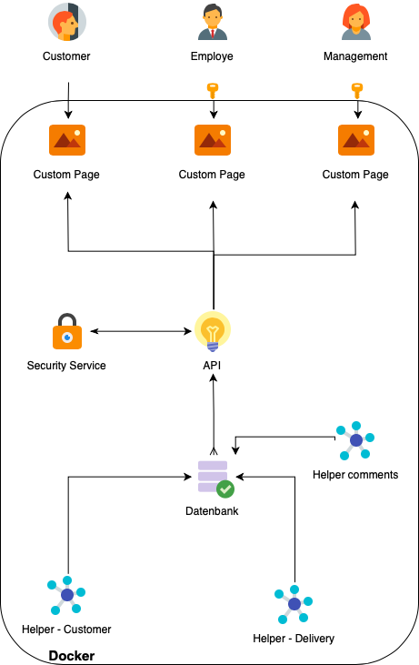
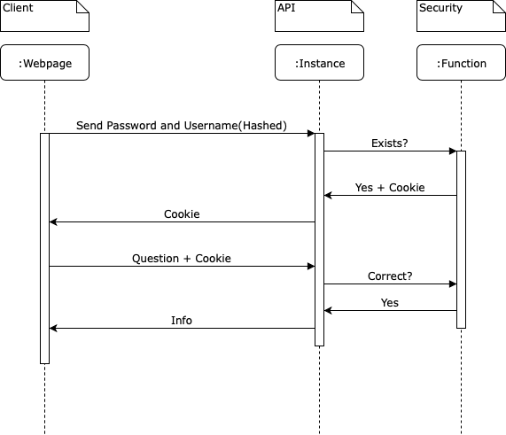

## How to build a cluster
Because of our requirments we have decided to use the Framework Kubernetes for our Project. Kubernetes is providing a framework to deploy a scalable cluster of docker containers. 
The Plan is to deploy all functions of the System in single containers, so we can easily deploy more containers of a speciall kind, if needed.

Because of their size and simplicity, we are planing to use python scripts for the helpers. 
Because of the experience of the Team with the language Java, we would like to use it for our API. 
The Webpages will be written in HTML and CSS, the logic in JavaScript. Because the team has never worked with any frameworks, we are only going to add Node and maybe some usefull Librarys for extra functionality. For the security function, we will either use a container and function on its own, or implement that function into our api.

The Database will be based on MYSQL

The Data for the Pages will be delivered by the API, however, we still have some functions that need to be used on function side like hashing or storing of security features.

Accroding to the ground law of programming "Slice and rule" we have devided the project in 10 smaler tasks. 

### Task 1 - Create the tables
For creating the tables automaticly, we will use a python script that will create the necessary tables if they don't exist yet. 

#### The Databases Structure
The Database should hold a few different Data fields. 
First and fourmoust the Products we sell, which includes all necessary data we would need like ABC regulation or Price.
Every user of our System has to get a role, which means he would need a storing place to store the data for the users. This table will also need a field for Passwords, but we will only store hashes, so even if the Database is breached the user data is not in danger. We will also need another Table for personal data, like adresses and full names. 
Another table will be made for transactions, like buying or selling of products and another table for revues and comments on our page. 

Some Tables will have special requirments to store data. 

##### Transaction table
This Database will store all transactions done to the database. To makes sure that the data is stored securly and is not alterable, we will use the block chain principle. 
This means that each row has a check sum containing the hashed last row. 

> Normaly a company should seperate most of these tables in different databases, so even if one database is braeached, the others is still safe. To keep things simple and because of resource shortage, we won't implement this and will store everything in the same base. 

### Task 2 - The API
The API will be written in Java and will be the only process connecting to the Database. 

#### Security Service
The Security Service has multiple tasks to solve. On the one hand it will provide all necessary functions to make sure that the user only gets the information he is allowed to, and will check all the given requests to the API for standart attacks, such as an SQL injection. The Security Service is seperated in two parts, the authentication Service and the parts in the API.

##### Injection Attacks
A known thread for a database is an SQL Injection. This means that the user is able to insert code into the given query and to collect more data than he is allowed to. If an SQL injection is possible, the attacker can get access to all data that is stored in the database or, in the worst case scenario can even alter it.
To counter this attack, our security function should scan every incoming request and check it for commands. This won't counter all SQL Attacks, but should get rid of the most obvious ones.

##### WhoAmI and WhoAreYou?
To make sure only the right Person can access the right data, we wil implement a small password checker. 

The system will get a hashed password and username from the webpage and then check the password with the database. If the information check our, the API will send a cookie with a tooken back, which will then be stored in the cache of the browser. 

The cookie itself contains information like user and timestamp which will then be signed by our private key and encrypted by our public key. 

If the user is now accessing data, he sends the coockie to the API with the request, which then gets checked with the database. The Authentication Service will then check the signature and the stored data. 

We will also implement a permission system so we can track what a person can do and what not. For Employes we will create specific rules, which can do more or less things. (For Example, Technician, Sales Person)

In the case that the given data is wrong at any point of the function, the API will answer with an Error and an Error Code. The client will then react to the given answer. 
### Task 3 - The Standart Web Page
The Standart Webpage is meant for persons who are not logged in in any way. Therfore the person can only see standart information, such as the Products and if it is available in the shop at that moment. 
If the standart Page is shown, the user gets the possibilities to login or to create a new User. (?)

### Task 4 - The Coustumers Page
A Customer can see everything the standart Person can see but in more depth. Instead of just an available String, the user can now see how many there are. A logged in User gets the extra feature of leaving comments, but can't create a new User. 

### Task 5 - The Employed Page
The Employed can see Information like what is available and when it will be available next. He can't create new comments, but he can read them.

### Task 6 - The Page for the Manager
The Manager gets information like sales figures and data about the delivers.  

> The Helpers are our little Workforce, our "virtuell People"

### Task 7 - Helper One, Creating orders

### Task 8 - Helper Two, Create deliveries

### Task 9 - Helper Three, Comment on what we did

### Task 10 - Building the cluster

### Optional Task - Deeper Analysis
Optional, we would like to implement a tool for deeper analysis. 
This will include predictions about the future, for example  about our stock, and the predicted actions of our customers. 

### Control Bot 
Because we deploy the System on an external Machine, we would like to keep track of everything that happens. For this Purpose, we create a Bot that checks the Satus of the System and will then send a message via Telegram. 

